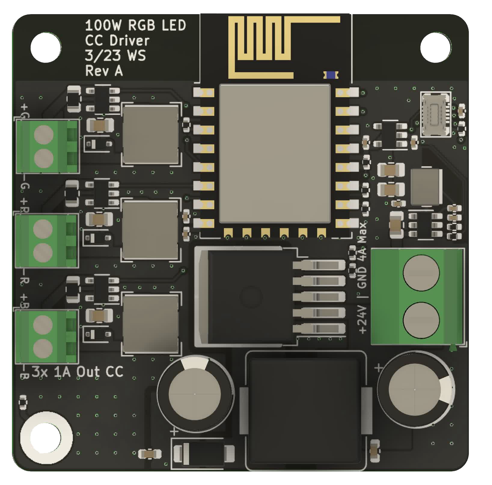
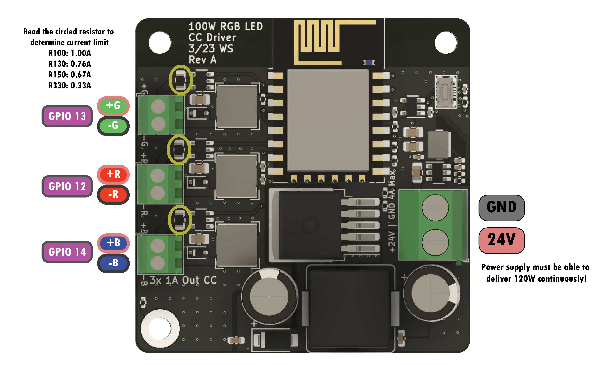

# 100W RGB LED Constant Current Driver
A constant current driver made to to drive 100W RGB COB LEDs

[Interactive BOM](https://htmlpreview.github.io/?https://raw.githubusercontent.com/wszeto9/100W-CC-Led-Driver/main/Documentation/ibom.html)

<h2> Features:</h2>
<ul>

<li>3 Constant current outputs for Red, Green, and Blue channel</li>
<li>Controlled with an ESP8266 running WLED and connected over Wi-Fi</li>
<li>Panelized in a 2x2 panel of 100x100mm for minimal fabrication costs at JLCPCB</li>
<li>BOM cost is kept low at around $6 per board
</ul>
<h2>Pinout</h2>

<h2> Bring-up and Usage </h2>

- Follow the iBOM and solder all items onto the board. 
- Attach the programming device onto the mezzamine connector on the top left of the board
- Program the ESP8266 with WLED
- Setup WLED with a single analog RGB channel attached to it. The pinouts should be:
    - Green: GPIO 13
    - Red: GPIO 12
    - Blue: GPIO 14
- Unplug the programming header and attach the LED and a 24V/5A power supply to the screw terminals
- Connect to the ESP's Wi-Fi network and turn on the lights!
